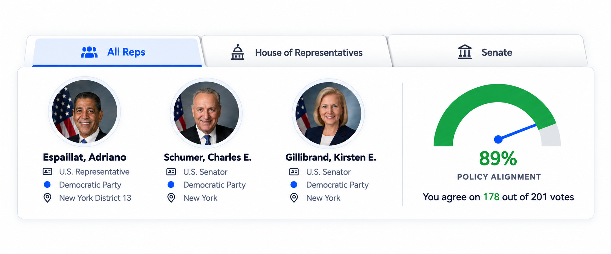

# Rep Card: Congressional Delegation and Chamber Tabs

Source: [VoteFeed Dev ticket](https://app.notion.com/p/3e6155d4c85080e4b09ad86aed3226b2) and its September 30, 2026 mockup.

## Desired user behavior

At the top of the feed, the Rep Card shows the user's congressional delegation: their current House member and the current Senators for their state. “All Reps” means this delegation, not every member of Congress.

- The card has three tabs in this order: **All Reps**, **House of Representatives**, and **Senate**. All Reps is selected when the card first loads.
- All Reps shows the House member and current Senators. House shows only the House member. Senate shows only the current Senators. Changing tabs changes **only the Rep Card**. The feed below, its votes, filters, counts, and pagination stay as they are.
- Each member has a portrait or initials, name, correct chamber title, party, and location. A House location includes its district; a Senate location shows the state. The member's official website remains available when known.
- The alignment gauge summarizes actual agreement between the user's saved stances and the recorded votes of the members visible on the selected tab. The count and percentage change with the tab. If there are no comparable votes, the card says “No alignment data yet” instead of showing 0%.
- A vacant seat simply does not appear. If a selected chamber has no current member, the card explains that. Loading and lookup errors are understandable without hiding the rest of the feed.
- The card works for a signed-in user with a saved address and a guest who has completed address lookup. A guest with no saved stances sees the alignment empty state.
- The tabs and member summaries work on narrow screens, with keyboard operation, visible focus, and an accessible selected state.

The mockup's 89% and 178/201 are examples, not data targets. Vote notifications remain House-only.

## Implementation steps

### 1. Load the delegation for the card

- [x] Use the signed-in user's saved state and district or the guest's address lookup result. Use full state names and preserve at-large House district `0`.
- [x] Find the current House member, if any, and all current Senators for that state. Reuse the existing district lookup and `GET /reps/state/:state/senators` route where practical. Do not assume there are always two Senators or a filled House seat.
- [x] Give the card a consistent member shape: Bioguide ID, chamber, name, party, state, House district when relevant, portrait, and official website when available. Represent an absent House member as `null` and Senators as an array.

Card data uses `{ houseMember, senators }` through `useCardDelegation`, with each member shaped as `{ bioguideId, chamber, name, party, state, district, portrait, officialWebsite }`. Chamber is `House` or `Senate`; Senate district and unavailable optional fields are `null`. Senate loading and errors stay separate from feed state. Rendering the Senators and chamber empty states remains in step 3.

Likely files: `server/src/api/reps.js`, `server/src/db/queries/reps.js`, and the client code that loads the Rep Card.

### 2. Define and calculate true vote alignment

- [ ] Trace how saved approve/disapprove stances relate to bills and recorded member votes. The current `getAlignmentByUserAndRep` counts interactions for one representative; its `approveCount` does not establish agreement with that member.
- [ ] Define a comparable pair as one saved user stance and one member vote on the same measure. Map support/opposition and Yea/Aye versus Nay consistently. Exclude missing stances, Present, Not Voting, unlinked votes, and other positions that cannot be compared.
- [ ] Decide how multiple roll calls by the same member on one measure are counted, then document and implement that rule in the alignment query. Count different members' comparable votes separately in All Reps, while avoiding duplicate copies of the same vote.
- [ ] Return agreement count and comparable count for the selected card members. Calculate the rounded percentage from those same counts. Return an empty state when the denominator is zero.
- [ ] Refresh the active tab's alignment after a stance is added, changed, or removed. If the card's existing alignment follows a selected feed policy area, keep that relationship and apply the same area to all three tabs without changing the feed itself.

Likely files: the alignment query, `server/src/api/users.js`, and the client code that refreshes Rep Card alignment.

### 3. Add the chamber tabs and member presentation

- [ ] Update `RepCard` to own the selected card tab and show only that tab's members and alignment. Follow the mockup's attached tab bar and blue active accent.
- [ ] Render chamber-specific titles and locations, portrait fallbacks, and official website links. Fit the visible members and gauge without overflow on mobile, at browser zoom, and with long names.
- [ ] Use semantic tab or button controls with keyboard support, visible focus, and a clear selected state. Handle loading, an empty chamber, partial delegation, lookup failure, and missing alignment data.
- [ ] Connect the signed-in and guest card paths. Check the separate `Profile.jsx` use of `RepCard` so its presentation still makes sense after the component changes.
- [ ] Keep the feed's existing vote retrieval, filters, counts, pagination, and navigation independent of the Rep Card tab state.

Likely files: `client/src/RepCard.jsx`, `client/src/RepCard.css`, `client/src/Feed.jsx`, `client/src/LandingPage.jsx`, and `client/src/Profile.jsx`.

## How to check it works

- [ ] A New York District 13 user sees their House member and current New York Senators in All Reps. House and Senate show only their respective members. Another state and district resolve independently.
- [ ] An at-large district `0` shows its House member. A Senate vacancy leaves the remaining Senator visible; an empty chamber tab explains the absence.
- [ ] Switching Rep Card tabs changes the visible members and true alignment counts and percentage. It does not change any feed vote, policy-area choice, count, page, or cursor.
- [ ] A saved stance change updates the card alignment. A guest with no stances and a user with no comparable votes see the empty state, not a false 0% gauge.
- [ ] Desktop, mobile, keyboard, and screen-reader checks cover the tabs, member details, and gauge. The House feed still works and no Senate notification emails are triggered.
